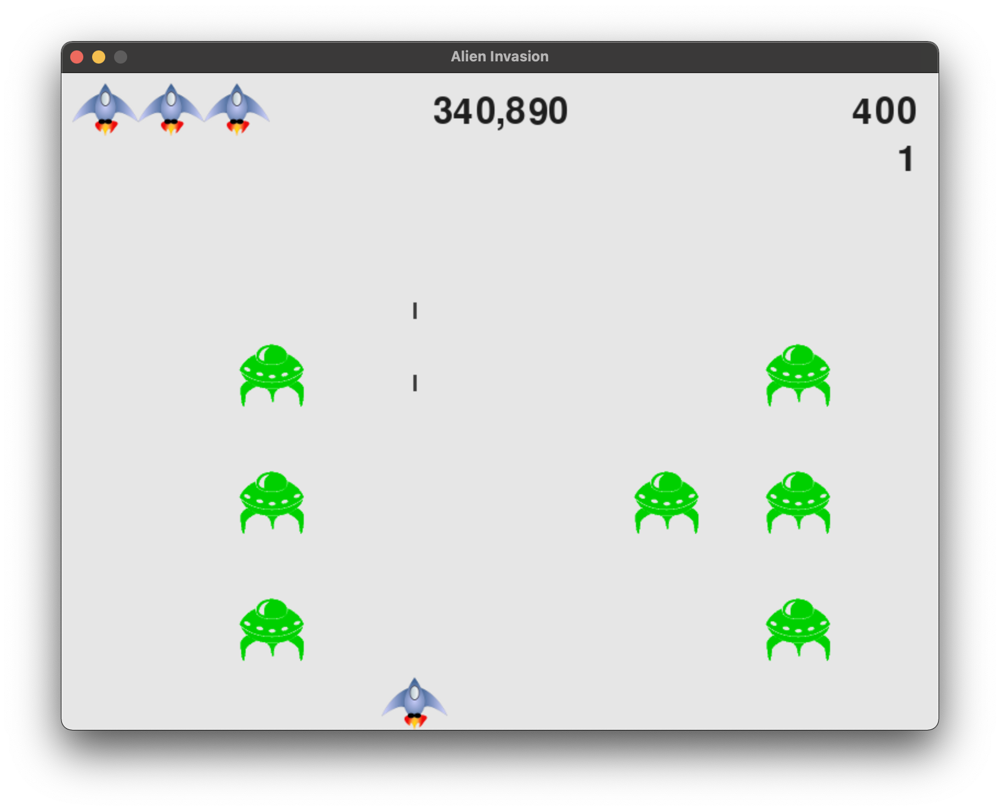

# Alien Invasion
### A game made from a guide in the book Python Crash Course by Eric Matthes

Once the start button is pressed, the aliens begin to descend on the player's ship, which is controlled by the arrow keys.
The player can shoot the aliens using the spacebar. Each alien is worth points, which is added to the player score at the top right of the screen.
If the player has a high score in the current instance of the game, it is added at the top which is the center text at the top of the screen.

Once an alien reaches the ship, the player loses a life which is represented as the three ships in the top right of the screen. 

Once all lives are lost, the game restarts.

THe high score is recorded and is present for the next game.

The pace of the game quickens as each wave of aliens have been shot down, represented by the level number below the player score. 
The higher the level, the more points the aliens are worth.

